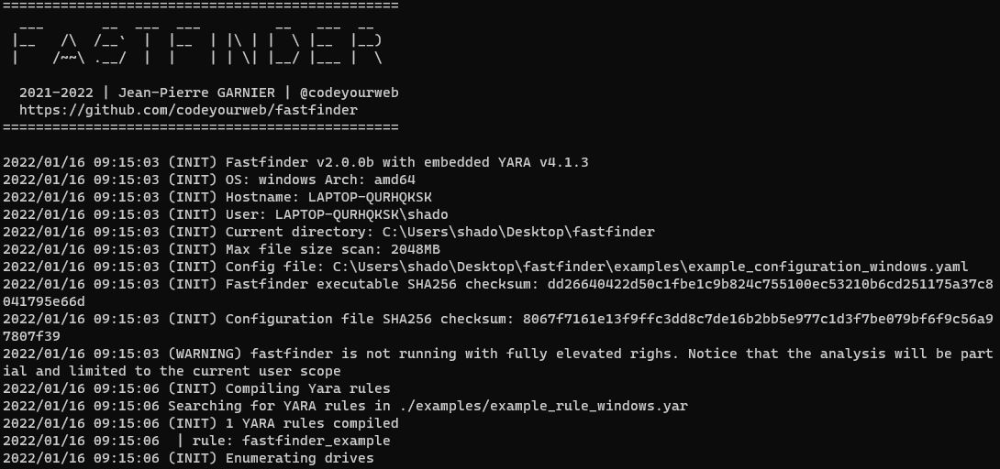
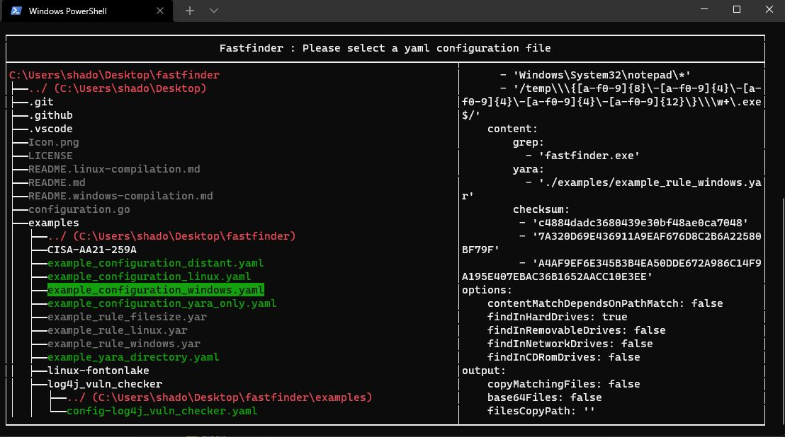
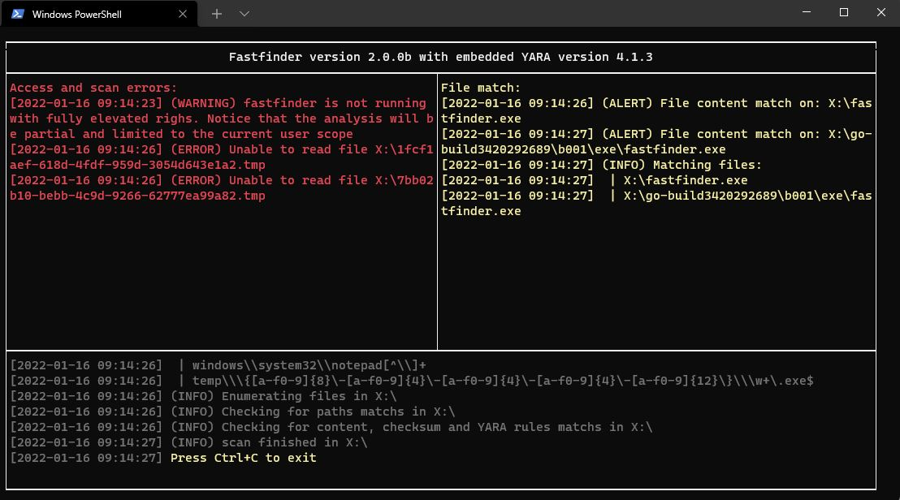

# FastFinder

**A lightweight incident response tool for threat hunting and forensic triage**

[](https://golang.org)
[](LICENSE)
[](https://github.com/codeyourweb/fastfinder/releases)
[](https://github.com/codeyourweb/fastfinder/actions)
[](https://github.com/codeyourweb/fastfinder/actions)
[](#installation)

## ✨ Overview

FastFinder is a powerful, lightweight incident response tool designed for cybersecurity professionals conducting threat hunting, live forensics, and endpoint triage. Built for both Windows and Linux platforms, it excels at rapid suspicious file discovery using multiple detection criteria.

### 🔍 Key Detection Capabilities

- **Path-based Detection**: File path and name pattern matching
- **Hash Verification**: MD5, SHA1, and SHA256 checksum validation
- **Content Analysis**: Simple string matching and complex YARA rule evaluation
- **Multi-platform Support**: Native Windows and Linux compatibility

### 🛡️ Battle-Tested

- ✅ **Production Ready**: Successfully deployed in real-world incident response scenarios
- ✅ **Industry Validated**: Used by multiple CERTs, CSIRTs, and SOC teams
- ✅ **Comprehensive Examples**: Includes real malware samples and vulnerability scan scenarios

## 📸 Screenshots


*Basic User Interface*


*Configuration Selection*


*Scan Results and Matches*

</details>

## 🚀 Installation

### Quick Start (Recommended)

**📥 [Download Latest Release](https://github.com/codeyourweb/fastfinder/releases/latest)**

### Building from Source

> ⚠️ **Note**: Compilation requires CGO and YARA dependencies. See platform-specific guides:

- 🪟 **Windows**: [Compilation Guide](README.windows-compilation.md)
- 🐧 **Linux**: [Compilation Guide](README.linux-compilation.md)

### Docker Installation (No Dependencies Required!)

The easiest way to build FastFinder without installing any dependencies:

```bash
# Build binaries for Linux and Windows
cd docker
make build-binaries

# Binaries will be in ./bin/
# - fastfinder-linux-amd64
# - fastfinder-windows-amd64.exe
```

#### Docker Runtime Container

Run FastFinder inside a privileged Docker container to scan volumes or mounted filesystems:

```powershell
# Build the runtime image (includes FastFinder + YARA + editors)
.\docker-helper.ps1 build-runtime

# Run scan with configuration directory
.\docker-helper.ps1 run-runtime -ConfigPath "C:\path\to\config_folder" -ScanPath "C:\data\to\scan"

# Interactive shell mode (no scan, just shell access)
.\docker-helper.ps1 run-runtime -Interactive
```

### Requirements

- **Runtime**: No dependencies required for pre-compiled binaries
- **Compilation**: Go 1.24+, CGO, libyara
- **Privileges**: Administrative rights recommended for full system access

## 📖 Usage

### Command Line Interface

```bash
fastfinder [OPTIONS]
```

### Available Options

| Option | Description | Default |
|--------|-------------|----------|
| `-h, --help` | Print help information | |
| `-c, --configuration <yaml config file>` | Configuration file path | |
| `-b, --build <output executable>` | Create standalone binary with embedded config (x64 architecture only) | |
| `-r, --root <Path>` | Scan root path (override drive enumeration) | |
| `-s, --silent` | Silent mode - run without any visible window or console | |
| `-v, --verbosity <verbosityLevel>` | Log verbosity level (1-5) | `3` |
| `-t, --triage` | Continuous monitoring mode | `false` |

### Verbosity Levels

- **Level 1**: Alerts only
- **Level 2**: Alerts and warnings
- **Level 3**: Alerts and errors (default)
- **Level 4**: Alerts, errors, and I/O operations  
- **Level 5**: Full verbosity (for debug purpose or really advanced logging)

### Quick Examples

```bash
# Basic scan with configuration file
./fastfinder -c config.yaml

# Continuous monitoring mode
./fastfinder -c config.yaml -t

# Create standalone executable (x64 architecture only)
./fastfinder -c config.yaml -b standalone_scanner.exe
```

> 💡 **Tip**: FastFinder can run with standard user privileges, but administrative rights provide access to all system files.

### Scan and export file match according to your needs
configuration examples are available [there](./examples). Here is a full configuration blank example. You do not need to implement every attribute if you are not using everything.

```yaml 
input:
    path: [] # match file path AND / OR file name based on simple string 
    content:
        grep: [] # match literal string value inside file content
        yara: [] # use yara rule and specify rules path(s) for more complex pattern search (wildcards / regex / conditions) 
        checksum: [] # parse for md5/sha1/sha256 in file content 
options:
    contentMatchDependsOnPathMatch: true # if true, paths are a pre-filter for grep (string) searches only. YARA and Checksums are always evaluated.
    findInHardDrives: true	# enumerate hard drive content
    findInRemovableDrives: true # enumerate removable drive content 
    findInNetworkDrives: true # enumerate network drive content
    findInCDRomDrives: true # enumerate physical CD-ROM and mounted iso / vhd...
output:
    copyMatchingFiles: true # create a copy of every matching file
    base64Files: true # base64 matched content before copy
    filesCopyPath: '' # empty value will copy matched files in the fastfinder.exe folder
advancedparameters:
    yaraRC4Key: ''    # yara rules can be (un)/ciphered using the specified RC4 key
    maxScanFilesize: 2048 #  ignore files up to maxScanFileSize Mb (default: 2048)               
    cleanMemoryIfFileGreaterThanSize: 512 # clean fastfinder internal memory after heavy file scan (default: 512Mb)
eventforwarding:
  enabled: true
  buffer_size: 5
  flush_time_seconds: 10
  file: # save app activity in jsonl files
    enabled: true
    directory_path: "./event_logs"
    rotate_minutes: 1    # Rotate every minute for testing
    max_file_size_mb: 1  # Rotate at 1MB for testing
    retain_files: 5      # Keep 5 old files
  http: # forward app activity with HTTP POST json data
    enabled: false
    url: "https://your-forwarder-url.com/api/events"
    ssl_verify: false
    timeout_seconds: 10
    headers:
      Authorization: "Bearer YOUR_API_KEY"
      MY-CUSTOM-HEADER: "My-Header-Value"
    retry_count: 3
  filters:
    event_types:
      - "error"
      - "warning"
      - "alert" 
      - "info"
``` 

### Search everywhere or in specified paths:
* use '?' in paths for simple char wildcard (eg. powershe??.exe)
* use '\\\*' in paths for multiple chars wildcard (eg. \\\*.exe)
* regular expressions are also available , just enclose paths with slashes (eg. /[0-9]{8}\\.exe/)
* environment variables can also be used (eg. %TEMP%\\myfile.exe)

### YARA Rules Path Resolution

**Relative paths in YAML configuration are resolved relative to the configuration file location:**

```yaml
input:
  content:
    yara:
      - "./example_rule_linux.yar"           # Looks in same folder as config.yaml
      - "./subfolder/custom_rules.yar"       # Looks in subfolder relative to config
      - "/absolute/path/to/rule.yar"         # Absolute paths work as-is
      - "https://example.com/rules.yar"      # URLs are also supported
```

Example directory structure:
```
project/
├── config.yaml
├── example_rule_linux.yar          # ✅ Found by "./example_rule_linux.yar"
└── rules/
    └── custom.yar                  # ✅ Found by "./rules/custom.yar"
```

### Important notes
* input path are always case INSENSITIVE
* content search on string (grep) are always case SENSITIVE
* backslashes HAVE TO be escaped (except with regular expressions)
* **YARA rules must exist** - missing rules will cause FastFinder to exit with an error
For more informations, take a look at the [examples](./examples)

## 🤝 Contributing

We welcome contributions! Please see our contribution guidelines:

1. **Fork** the repository
2. **Create** a feature branch (`git checkout -b feature/amazing-feature`)
3. **Commit** your changes (`git commit -m 'Add amazing feature'`)
4. **Push** to the branch (`git push origin feature/amazing-feature`)
5. **Open** a Pull Request

### Development Setup

```bash
# Clone the repository
git clone https://github.com/codeyourweb/fastfinder.git
cd fastfinder

# Install dependencies (see compilation guides)
# Build from source
go build -tags yara_static,gio -a -ldflags '-s -w' .

# Run tests
go test ./...
```

## 📜 License

This project is licensed under the AGPL License - see the [LICENSE](LICENSE) file for details.

## 🚀 Support

- **🐛 Report Issues**: [GitHub Issues](https://github.com/codeyourweb/fastfinder/issues)
- **💬 Discussions**: [GitHub Discussions](https://github.com/codeyourweb/fastfinder/discussions)
- **📧 Security**: Report security vulnerabilities privately

## 📊 Project Stats


## 🙏 Acknowledgments

* **Hilko Bengen (@hillu)** for his wonderful [yara implementation in Go](https://github.com/hillu/go-yara) and also for his precious help debugging CGO issues 
* **Marc Ochsenmeier** for his precious help, feedbacks but also for having talking on my project
* **Vitali Kremez** ✝ for inspiring me on many aspects that made me build fastfinder
* **m0n4** (https://github.com/m0n4) for regularly challenging me technically and contributing much more to the birth of this project than he could ever imagine.
---

**Made with ❤️ by the cybersecurity community**  
Created by Jean-Pierre GARNIER (@codeyourweb) • 2021-2026
